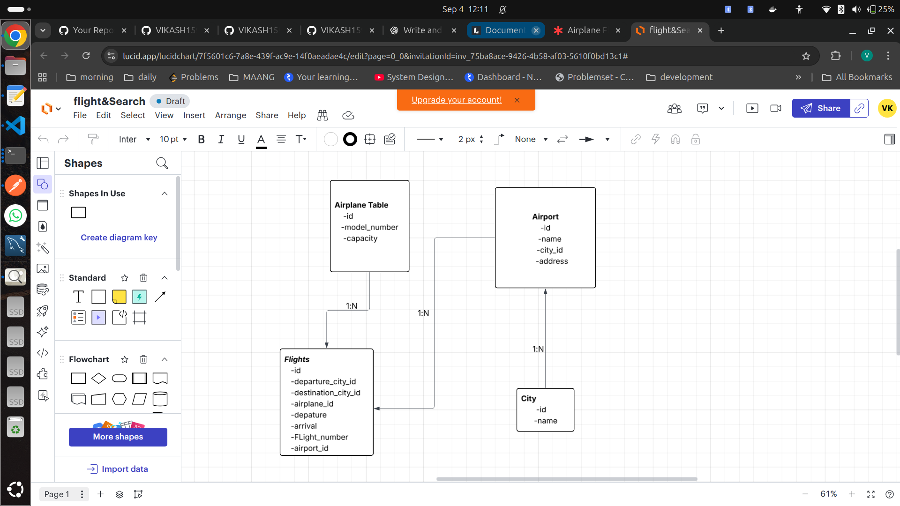
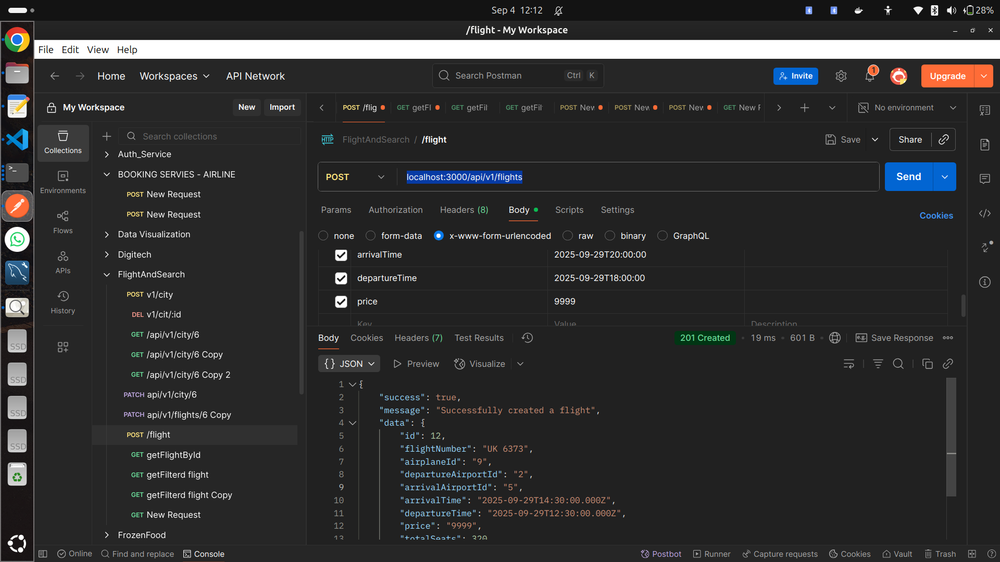

# Welcome to Flights Service

## Project Setup

- Clone the project on your local
- Execute `npm install` on the same path as your root directory of the downloaded project
- Create a `.env` file in the root directory and add the following environment variable:

  - `PORT=3000`

- Inside the `src/config` folder create a new file `config.json` and then add the following piece of JSON:

  ```
  {
    "development": {
        "username": "<YOUR_DB_LOGIN_NAME>",
        "password": "<YOUR_DB_PASSWORD>",
        "database": "Flights_Search_DB_DEV",
        "host": "127.0.0.1",
        "dialect": "mysql"
    }
  }
  ```

- Once you've added your db config as listed above, go to the src folder from ypur terminal and execute `npx sequelize db:create`
  and then execute `npx sequelize db:migrate`

## DB Design

- **Airplane Table**
- **Flight**
- **Airport**
- **City**

**About:**

- A flight belongs to an airplane, but one airplane can be used in multiple flights.
- A city has many airports, but one airport belongs to a city.
- One airport can have many flights, but a flight belongs to one airport.

## Tables

  
_Tables Association_

  
_Flight creation_

---

## Flight Data Structure

```
The Flight Service manages flight details with the following fields:

| Field Name         | Example Value       | Description                           |
| ------------------ | ------------------- | ------------------------------------- |
| flightNumber       | UK 6373             | Unique flight identifier              |
| airplaneId         | 9                   | ID of the airplane used               |
| departureAirportId | 2                   | ID of the departure airport           |
| arrivalAirportId   | 5                   | ID of the arrival airport             |
| departureTime      | 2025-09-29T18:00:00 | Scheduled departure time (ISO format) |
| arrivalTime        | 2025-09-29T20:00:00 | Scheduled arrival time (ISO format)   |
| price              | 9999                | Flight ticket price (currency units)  |
```

---

```
{
    "success": true,
    "message": "Successfully created a flight",
    "data": {
        "id": 12,
        "flightNumber": "UK 6373",
        "airplaneId": "9",
        "departureAirportId": "2",
        "arrivalAirportId": "5",
        "arrivalTime": "2025-09-29T14:30:00.000Z",
        "departureTime": "2025-09-29T12:30:00.000Z",
        "price": "9999",
        "totalSeats": 320,
        "updatedAt": "2025-09-04T06:42:46.902Z",
        "createdAt": "2025-09-04T06:42:46.902Z"
    }
}
```

### City -> id,name,created_at,updated_at

### Airport -> id,name,address,city_id,created_at,updated_at

    Relationship -> City has many airports and Airports belongs to a city (one to many)

```
npx sequelize model:generate --name Airport --attributes name:String,address:String,cityId:integer
```

## Generating seed values

```
npx sequelize seed:generate --name add-airports
npx sequelize db:seed:all

```

---

## Key Features

- **<Flight/Search> Management**:

  - Flight Service: manage flights, schedules, and availability.
  - Search Service: query flights based on origin, destination, and date.

- **Database Integration**:

  - Uses **Sequelize** ORM for models, migrations, and queries.
  - MySQL handles persistent storage and relationships.

- **API Gateway Integration**:

  - Routes requests through the gateway to the correct service.
  - Performs validation and error handling before processing requests.

- **Modular JavaScript Structure**:

  - Separate modules for database models, controllers, and routes.
  - Clear folder structure for maintainable code.

- **Asset Management** (optional):
  - Images, email templates, or other static files in the `assets` folder.

---

## Learning Outcomes

- Learned **Sequelize + MySQL integration** in Node.js microservices.
- Hands-on experience with **API Gateway routing** and modular service design.
- Managed **search queries and flight data** efficiently with ORM.
- Developed scalable microservices ready for integration with Booking and Reminder services.

---
